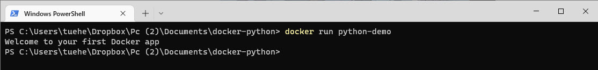
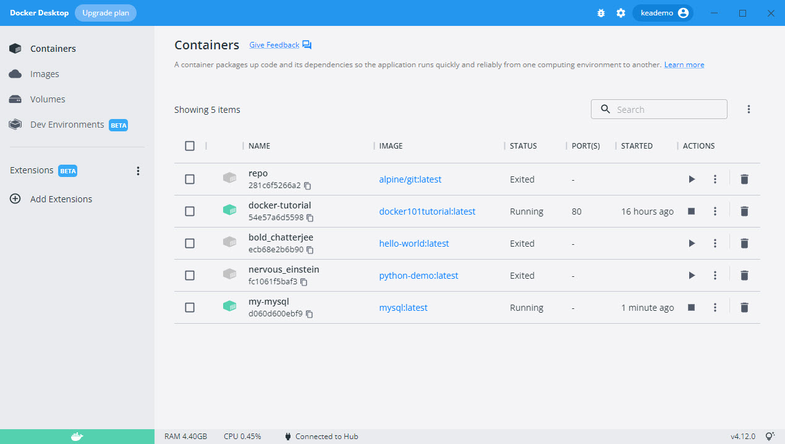
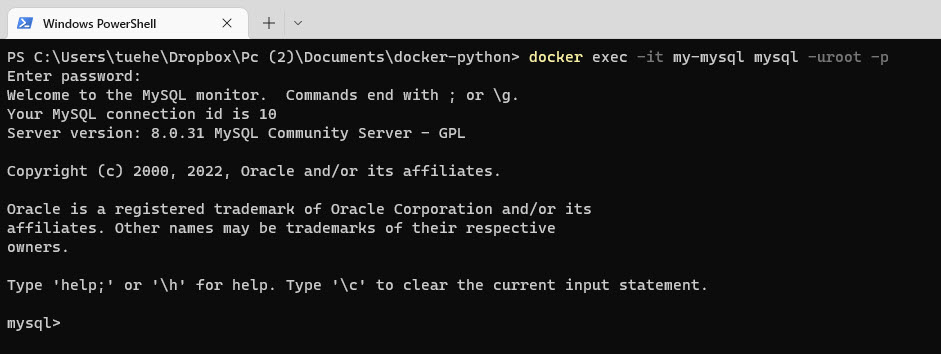
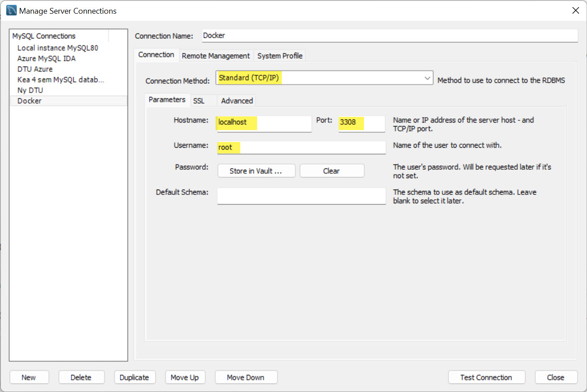

# Create your fist Docker application
The purpose of this Docker application is to create a Python program that print/displays a sentence. 

The Python program will have to be launched through Dockerfile.

Note: You must have install Docker on your computer

## Create the application
You have to create a folder on your computer - minfirstdockerapp

It must contain the following two files:

- **main.py** - *Python file containing the code to be executed*
- **Dockerfile** - *Docker file that will contain the necessary instructions to create the environment*

### main.py
The main.py file is very simpel for this demo

```python
print("Welcome to your first Docker app")
```

### Dockerfile
The purpose of this Docker file is to run your Python code.

To do this, your Docker must contain all the dependencies necessary to launch Python. A Linux (*Ubuntu*) with Python installed on it should do the trick.

First step in creating the Dockerfile is to access the DockerHub website - [hub.docker.com](https://hub.docker.com)

The DockerHub website contains many pre-designed images you can use. For this case, type **Python** in the search bar. 


The first result is the official image to execute Python.

You must create a Dockerfile and add this commands:

```dockerfile
# Importing the base image.
FROM python:latest

# To launch your python code, you must import it into our image.
# Use the keyword 'COPY' to do that.
# The first parameter 'main.py' is the name of the file on the host.
# The second parameter '/' is the path where to put the file on the image.
COPY main.py /

# You need to define the command to launch when you run the image.
# Use the keyword 'CMD' to do that.
CMD [ "python", "./main.py" ]
```

Remember that the Dockerfile doesn't have a file extension

## Run the application
The launce of your application are done in 2 parts

### Build
    docker build -t python-demo . 


### Launch
    docker run python-demo




# MySQL Docker


# Get MySQL Docker image

    docker pull mysql

# Start a mysql server instance

    docker run --name some-mysql -e MYSQL_ROOT_PASSWORD=my-secret-pw -d mysql:tag

where **some-mysql** is the name you want to assign to your container, **my-secret-pw** is the password to be set for the MySQL **root user** and **tag** is the tag specifying the **MySQL version** you want.

It could be

    docker run -p 3308:3306 --name my-mysql -e MYSQL_ROOT_PASSWORD=Kea1234#! -d mysql:latest

- The **-p 3308:3306** is the definition of the port the MySQL server are using
- Password: **Kea1234#!**

Standard port number for MySQL is 3306, but this number are you using for the local MySQL server you have on the computer. You have to get a new port number.

The port number definition is:
- localhost:container
- 3308:3306

    docker exec -it my-mysql mysql -uroot -p


## Docker Desktop


# Access to MySQL Server
Now yo need to access the MySQL Server.

## From an terminal
From a terminal you can use:

    docker exec -it my-mysql mysql -uroot -p

for access to the server. Use the password you created.



## From MySQL Workbench
From MySQL Workbench you have to use:

Hostname: localhost
Port: 3308
Username: root



# Link
- You can finde more information about this Docker file at [https://hub.docker.com/_/mysql](https://hub.docker.com/_/mysql)
- Git repo of the Docker "Official Image" for mysql [github.com/docker-library/mysql](https://github.com/docker-library/mysql)