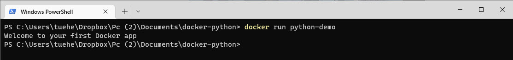

# Ubuntu Docker
Use thise command for creating an Ubuntu container

    docker pull ubuntu
    docker ps
    docker inspect -f "{{ .NetworkSettings.IPAddress }}" test
    docker exec -it nginx /bin/bash


## Openssh Server
    apt update && apt -y install openssh-server
    echo "PermitRootLogin yes" >> /etc/ssh/sshd_config
    passwd
    /etc/init.d/ssh start
    ssh root@172.17.0.2

# Create your fist Docker application
The purpose of this Docker application is to create a Python program that print/displays a sentence - *Welcome to your first Docker app*

The Python program will have to be launched through Dockerfile.

Note: You must have install Docker on your computer

## Create the application
You have to create a folder on your computer - **myfirstdockerapp**

It contains the following two files:

- **main.py** - *Python file containing the code to be executed*
- **Dockerfile** - *Docker file that will contain the necessary instructions to create the environment*

### main.py
The main.py file is very simpel for this demo

```python
print("Welcome to your first Docker app")
```

### Dockerfile
The purpose of this Docker file is to run your Python code.

To do this, your Docker must contain all the dependencies necessary to launch Python. A Linux (*Ubuntu*) with Python installed on it should do the trick.

First step in creating the Dockerfile is to access the DockerHub website - [hub.docker.com](https://hub.docker.com)

The DockerHub website contains many pre-designed images you can use. For this case, type **Python** in the search bar. 


The first result is the official image to execute Python.

You must create a Dockerfile and add this commands:

```dockerfile
# Importing the base image
FROM python:latest

# To launch your python code, you must import it into our image
# Use the keyword 'COPY' to do that
# The first parameter 'main.py' is the name of the file on the host
# The second parameter '/' is the path where to put the file on the image
COPY main.py /

# You need to define the command to launch when you run the image
# Use the keyword 'CMD' to do that
CMD [ "python", "./main.py" ]
```

Remember that the Dockerfile doesn't have a file extension

## Run the application
The launce of your application are done in 2 parts

### Build
    docker build -t python-demo . 


### Launch
    docker run python-demo




## Using Pandas, Python and Docker
Using a Docker container to run a Python application using Pandas library to import the **customers.csv** file. 


You are going to use:

- **Docker**
- **Python**
- **Pandas**

In the development of a applications you need a consistent environment across all your devices.
It can be time consuming to install all the dependencies from scratch whenever you try to run your code on a new device or in a new environment.

> **Docker is here to solve exactly this problem.**

Docker provides a way to package everything you need to run your applications in a Container which you can download or pull into all the devices you use and just start working right away.

## Files
The files for this demo is located in the folder **docker-demo**

- customers.csv
- demo1_app.py
- Dockerfile

## Steps
There are 3 steps in this demo:

1. Installing Python and Pandas onto our system and making the Python application
2. Creating a Docker Image file which will be used to make a Container
3. Testing the container

## Installing

1. Install **Python**, *if its NOT on on your system*
2. Install **Pandas**, *if its NOT on on your system*

```
pip3 install pandas
```

3. Create a project directory **docker_demo_pandas**
4. Copy the file **customers.csv** to this directory
5. In this folder, make a new python file - **demo_pandas_app.py**
6. Write this code in the **demo_pandas_app.py** file

```
import pandas as pd
df = pd.read_csv('customers.csv')
print(df.head(10))
```
    
6. Run the Python file to make sure that everything is working

## Creating a Docker Image file which will be used to make a Container
1. Install Docker, *if its NOT on your system*, by going to there website and following the installation steps - https://docs.docker.com/engine/install/
2. Make a new file in your **docker_demo_pandas** directory and name it **Dockerfile**. *Be sure **not** give it an extension.*
3. Write this code in - **Dockerfile**:

```
# syntax=docker/dockerfile:1
FROM python:3.8-slim-buster
RUN /usr/local/bin/python -m pip install --upgrade pip
RUN pip install pandas
COPY . .
CMD [ "python", "demo_pandas_app.py"]
```

- **First line** tells the docker engine on how to read/parse the lines coming after it. This line always has to be the first line before any spaces or characters
- **Second line** downloads a base python image from Dockerhub. It is an environment that already has python installed on it
- **Third line** upgrades the Pip as the above image is running an old version of it
- **Fourth line** installs Pandas library in the image. This is a crucial step that we will also use to test our Docker image next
- **Fifth line** copies all the files in the current directory and stores them onto the file system attached with the docker image
- **Sixth line** tells Docker image on what to do when the Run command is given

4. Open to your **commandpromt** and make a docker image by typing:

```
docker build --tag docker-demo1 .
```


*Make sure that Docker demon is running*

## Testing the container
1. Run the docker image by typing, in your commandpromt:

```
docker run docker_demo_pandas
```

Now you will see the Pandas dataframe on the screen.


**Rember** - If you make any changes you have to run

```
docker build --tag demo_pandas_app.py .
```
**before** you run 

```
docker run demo_pandas_app
```


## MySQL and Docker

### Get MySQL Docker image

    docker pull mysql

### Start a mysql server instance

    docker run --name some-mysql -e MYSQL_ROOT_PASSWORD=my-secret-pw -d mysql:tag

where **some-mysql** is the name you want to assign to your container, **my-secret-pw** is the password to be set for the MySQL **root user** and **tag** is the tag specifying the **MySQL version** you want.

It could be

    docker run -p 3308:3306 --name my-mysql -e MYSQL_ROOT_PASSWORD=Kea1234#! -d mysql:latest

- The **-p 3308:3306** is the definition of the port the MySQL server are using
- Password: **Kea1234#!**

Standard port number for MySQL is 3306, but this number are you using for the local MySQL server you have on the computer. You have to get a new port number.

The port number definition is:
- localhost:container
- 3308:3306

    docker exec -it my-mysql mysql -uroot -p


### Docker Desktop


## Access to MySQL Server
Now yo need to access the MySQL Server.

### From an terminal
From a terminal you can use:

    docker exec -it my-mysql mysql -uroot -p

for access to the server. Use the password you created.


### From MySQL Workbench
From MySQL Workbench you have to use:

Hostname: localhost
Port: 3308
Username: root


## Link
- You can finde more information about this Docker file at [https://hub.docker.com/_/mysql](https://hub.docker.com/_/mysql)
- Git repo of the Docker "Official Image" for mysql [github.com/docker-library/mysql](https://github.com/docker-library/mysql)