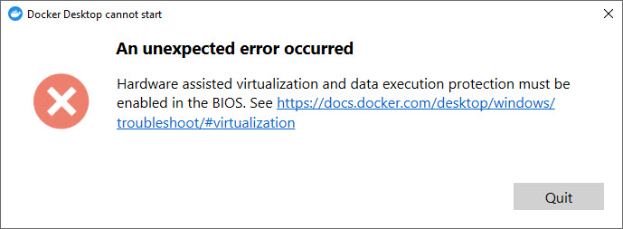
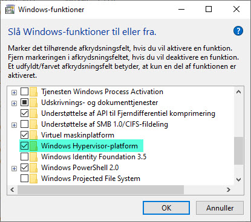

# Docker Troubleshooting

## Hardware assisted virtualization and data execution protection must be enabled in the BIOS
If you get this error message starting Docker Desktop, it indicates that there is a problem with Hyper-V.

The problem with Hyper-V that is disabled or Hypervisor agent not running.

## If Hyper-V is totally disabled or not installed
You can try 2 differst ways

### 
- Go to **Control Panel -> [Programs] -> [Windows Features]**
- Check **Windows Hypervisor-platform**
- Restart the system

### PowerShell
- Open PowerShell as administrator and
- Enable Hyper-V with

    dism.exe /Online /Enable-Feature:HypervisorPlatform /All

## If Hyper-V feature is already enabled but doesn't work
- Enable Hypervisor with

    bcdedit /set hypervisorlaunchtype auto

Now restart the system and try again.

